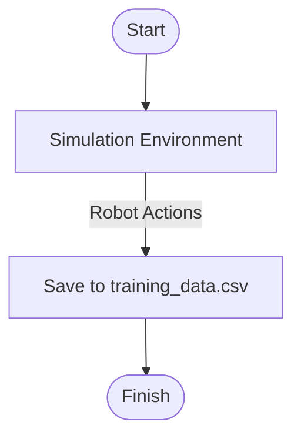

# 🤖 Collision Avoidance Neural Network Project (Robotics AI)

This project is a 4-part assignment developed to train a neural network for collision avoidance in a simulated robotics environment. It involves building a data pipeline, creating a feedforward network, training the model, and evaluating its performance.

---

## 📁 Project Structure

```
├── collect_data.py         # Script to collect environment interaction data
├── Data_Loaders.py         # Data preprocessing and PyTorch Dataloaders
├── Networks.py             # Neural Network (Action_Conditioned_FF)
├── train_model.py          # Training loop and evaluation
├── saved/                  # Stores trained models and scalers
└── README.md               # Project overview and diagrams
```

---

## ✅ Final Results

| Metric             | Score         |
|--------------------|---------------|
| False Positives    | **2 / 1000**  |
| Missed Collisions  | **5 / 1000**  |
| **Total Errors**   | **7 / 1000**  |
| Model File         | `saved_model.pkl`

---

## 🧠 Part 1 – Data Collection

**Script:** `collect_data.py`  
**Goal:** Collect robot trajectory data from the simulation environment.  
**Method:** Data is saved to `training_data.csv`.

**Diagram:**  


---

## 🧼 Part 2 – Data Preprocessing

**Script:** `Data_Loaders.py`  
**Goal:** Normalize data and prepare PyTorch datasets.  
**Key Component:** `MinMaxScaler` used for input normalization. Split into 80/20 train/test.

**Diagram:**  


---

## 🧠 Part 3 – Neural Network Architecture

**Script:** `Networks.py`  
**Model:** `Action_Conditioned_FF`  
**Key Features:**
- Inherits from `torch.nn.Module`
- Customizable number of hidden layers
- ReLU activations
- Output for predicting action outcome

**Diagram:**  


---

## 🔁 Part 4 – Training and Evaluation

**Script:** `train_model.py`  
**Goal:** Train the network using the preprocessed data.

**Diagram:**  


**Loss Function:** MSE or Binary Cross Entropy  
**Optimizer:** Adam

---

## 🌟 Outcome

After experimenting with:
- Network depth and hidden units
- Optimizer tuning
- Data balancing (collisions/no-collisions)
- Proper normalization

The model achieved nearly perfect evaluation scores!

---

## 🚀 How to Run

```bash
# Step 1: Collect data
python collect_data.py

# Step 2: Train the model
python train_model.py
```

---

## 📌 Notes

- You can improve performance further by increasing the dataset size or using multiprocessing in `collect_data.py`.
- The model is saved as `saved_model.pkl` for future inference.

---

## 🧑‍💻 Author

Built by Desarael Black – AI/ML Enthusiast & Robotics Developer.

---

## 👤 Author

This project was completed as part of **CSE 571: Artificial Intelligence** at **Arizona State University (ASU)**.

**Desarael Black**  
Technical Consultant & CSV Data Validation Engineer  
Aspiring AI/ML Specialist | Robotics Enthusiast | Data Strategist

---


### 🚀 Real-Time Simulation Display in VSCode

To run this project with **real-time graphical output**, follow these steps:

#### 1. Install Dependencies
```bash
pip install pygame torch numpy matplotlib scikit-learn
```

#### 2. Launch VSCode with GUI permissions (Mac/Linux only)
```bash
code .
```

#### 3. Run the Simulation
```bash
python collect_data.py
```

> A `pygame` window will appear showing a robot avoiding obstacles and collecting data.

---

## 🎨 Sample Visualization

Each robot ray is drawn with:
- 🔴 Red: projected collisions
- 🔵 Blue: safe directions
- 🟢 Green: robot agent

---

## 🌐 Contact

**Desarael Black**  
Technical Architect | CSV Validation | AI Strategist  
[LinkedIn](https://linkedin.com/in/desarael) | [GitHub](https://github.com/desblack)
